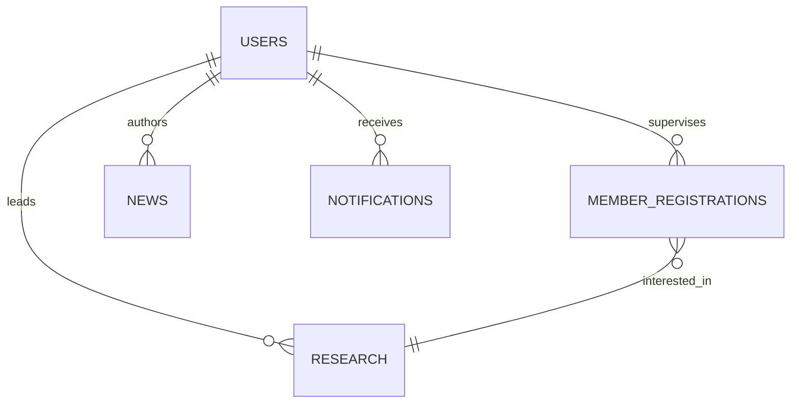

# 🤖🧪 Lab IVSS – Portal Management System

> **Portal Lab Intelligent Vision and Smart System – Politeknik Negeri Malang**  
> Proyek Basis Data (PBL) | Computer Vision & Smart Systems Lab

[](https://www.php.net/)
[](https://www.postgresql.org/)
[](https://tailwindcss.com/)

---

## 📖 Daftar Isi

- [Tentang](#-tentang)
- [Fitur Utama](#-fitur-utama)
- [Database Schema](#-database-schema)
- [Tech Stack](#-tech-stack)
- [Instalasi](#-instalasi)
- [User Roles](#-user-roles--permissions)
- [API Routes](#-api-routes)
- [Testing](#-testing)

---

## 👋 Tentang

**Lab IVSS** adalah laboratorium riset di Politeknik Negeri Malang yang fokus pada **Computer Vision**, **AI**, dan **IoT Smart Systems**.

**Portal Web ini** adalah sistem manajemen terintegrasi untuk:
- ✅ Pendaftaran member dengan approval bertingkat (Dosen → Ketua Lab)
- ✅ Tracking riset & publikasi ilmiah
- ✅ Inventaris peralatan lab
- ✅ Dashboard analytics real-time

> 💡 Proyek PBL dengan fokus implementasi **database relasional PostgreSQL** dan **native PHP OOP**

---

## 🔥 Fitur Utama

### 👨‍💼 **Admin & Ketua Lab**
- System overview & user management (CRUD semua role)
- Final approval pendaftar member (Ketua Lab)
- Kelola berita, riset, equipment
- Real-time notifications

### 👨‍🏫 **Dosen**
- Dashboard statistik mahasiswa bimbingan
- **Approval pertama** pendaftar (yang pilih sebagai pembimbing)
- CRUD publikasi dosen (jurnal, konferensi, indexed Scopus Q1/Q2)
- List mahasiswa bimbingan (filter angkatan, export Excel)
- Kelola riset bimbingan

### 🧑‍🎓 **Member**
- Dashboard riset & publikasi
- View profile & edit biodata
- Change password (bcrypt)
- List riset lab & publikasi

### 🌐 **Public (No Login)**
- Landing page Lab IVSS
- Form pendaftaran member online
- List riset & publikasi lab
- Berita & kegiatan lab

---

## 🗄️ Database Schema

Portal menggunakan **PostgreSQL** dengan **8 tabel utama**:

### Tabel & Relasi:

```
users (admin, ketua_lab, dosen, member)
  ↓ supervises
member_registrations (approval bertingkat)
  ↓ interested_in
research (riset lab)

users → news (author)
users → notifications (recipient)

+ equipment (inventaris)
+ publications (jurnal, konferensi)
+ system_settings (konfigurasi)
```

### Entity Relationship Diagram:



### Tabel USERS

```sql
CREATE TABLE users (
    id SERIAL PRIMARY KEY,
    name VARCHAR(255) NOT NULL,
    email VARCHAR(255) UNIQUE NOT NULL,
    password VARCHAR(255) NOT NULL,
    role VARCHAR(50) DEFAULT 'member',        -- admin, ketua_lab, dosen, member
    status VARCHAR(50) DEFAULT 'active',       -- active, inactive
    nim VARCHAR(50),                           -- mahasiswa
    nip VARCHAR(50),                           -- dosen
    phone VARCHAR(20),
    angkatan VARCHAR(10),
    origin VARCHAR(255),
    supervisor_id INTEGER REFERENCES users(id), -- dosen pembimbing
    created_at TIMESTAMP DEFAULT CURRENT_TIMESTAMP,
    updated_at TIMESTAMP DEFAULT CURRENT_TIMESTAMP,
    last_login TIMESTAMP
);
```

### Tabel MEMBER_REGISTRATIONS

```sql
CREATE TABLE member_registrations (
    id SERIAL PRIMARY KEY,
    name VARCHAR(255) NOT NULL,
    email VARCHAR(255) NOT NULL,
    nim VARCHAR(50),
    password VARCHAR(255),
    supervisor_id INTEGER REFERENCES users(id),
    status VARCHAR(50) DEFAULT 'pending_supervisor',
    -- pending_supervisor → pending_lab_head → approved → rejected
    supervisor_approved_at TIMESTAMP,
    lab_head_approved_at TIMESTAMP,
    created_at TIMESTAMP DEFAULT CURRENT_TIMESTAMP
);
```

**Approval Flow:**
```
Registration → pending_supervisor (Dosen) → pending_lab_head (Ketua Lab) → approved (Create User)
```

### Tabel Lainnya:

**research** - Data riset (title, category, leader_id, status, funding)  
**news** - Berita lab (title, content, author_id, status: draft/published)  
**equipment** - Inventaris (name, category, condition, location)  
**publications** - Publikasi (title, authors, DOI, citations, type)  
**notifications** - Notifikasi real-time (user_id, message, is_read)  
**system_settings** - Konfigurasi sistem (key-value)

---

## ⚙️ Tech Stack

| Technology | Purpose |
|------------|---------|
| **PHP Native 8.x** | Backend (pure PHP OOP, no framework) |
| **PostgreSQL 14+** | Database relasional |
| **Tailwind CSS** | Styling responsive |
| **JavaScript Vanilla** | Interactivity & real-time search |

**Why PHP Native?** Fokus tugas kampus pada konsep database & SQL query.

---

## 📁 Struktur Project

```
Lab ivss/
├── app/
│   ├── config/database.php          # PostgreSQL connection
│   ├── controllers/                 # 6 controllers (~110 KB)
│   │   ├── AdminController.php      # Admin & Ketua Lab (44 KB)
│   │   ├── AuthController.php       # Login/Register (15 KB)
│   │   ├── MemberController.php     # Member dashboard (13 KB)
│   │   └── UserController.php       # User CRUD (14 KB)
│   └── helpers/                     # Helper functions
│
├── view/
│   ├── admin/                       # Admin & Dosen panel
│   │   ├── publications/index.php   # Publikasi dosen
│   │   ├── students/index.php       # Mahasiswa bimbingan
│   │   ├── members/approve.php      # Approval bertingkat
│   │   └── dashboard.php
│   ├── member/
│   │   ├── settings/                # Profile settings
│   │   │   ├── index.php            # View profile
│   │   │   ├── edit.php             # Edit profile
│   │   │   └── change-password.php  # Change password
│   │   └── dashboard.php
│   ├── layouts/                     # Admin, member, auth layouts
│   └── auth/                        # Login, register
│
├── public/
│   ├── index.php                    # Main router (160 lines)
│   └── assets/                      # CSS, JS, images
│
├── database/
│   └── setup_database.sql           # Complete DB setup (722 lines)
│
└── README.md
```

**Project Stats:**
- Total Files: ~100+ PHP files
- Total Lines: ~15,000+ lines
- Database Tables: 8 tables
- Routes: ~25 endpoints

---

## 🛠️ Instalasi

### Prerequisites
- PHP >= 8.0
- PostgreSQL >= 14
- Apache/Nginx

### Quick Start

```bash
# 1. Clone repository
git clone https://github.com/hafisc/lab-ivss-pbl.git
cd lab-ivss-pbl

# 2. Setup database
psql -U postgres
CREATE DATABASE lab_ivss;
\c lab_ivss
\i database/setup_database.sql
\q

# 3. Konfigurasi database
# Edit app/config/database.php sesuai kredensial Anda

# 4. Akses
# http://localhost/lab-ivss-pbl/public
```

---

## 👥 User Roles & Permissions

### Role Hierarchy:
```
Admin → Ketua Lab → Dosen → Member
```

### Permission Matrix:

| Feature | Admin | Ketua Lab | Dosen | Member |
|---------|-------|-----------|-------|--------|
| User Management | ✅ | ✅ | ❌ | ❌ |
| Approve Member (First) | ❌ | ❌ | ✅ | ❌ |
| Approve Member (Final) | ❌ | ✅ | ❌ | ❌ |
| View Registrations | ✅ (read-only) | ✅ | ✅ (filtered) | ❌ |
| Manage Publications | ❌ | ❌ | ✅ (own) | ❌ |
| View Students | ❌ | ❌ | ✅ (own) | ❌ |
| Edit Profile | ✅ | ✅ | ✅ | ✅ |
| Change Password | ✅ | ✅ | ✅ | ✅ |

### Role-Specific Features:

**Admin:**
- Full system access (superuser)
- User CRUD (all roles)
- View-only approval (tidak bisa approve/reject)
- System settings

**Ketua Lab:**
- Final approval pendaftar (after dosen)
- CRUD riset, berita, equipment
- Real-time notifications

**Dosen:**
- First approval pendaftar (own students)
- CRUD publikasi dosen
- List mahasiswa bimbingan
- Export Excel

**Member:**
- View profile & research
- Edit profile & change password
- View-only lab data

### Approval Flow Detail:

```
┌─────────────────────────┐
│ 1. Member Register      │
│    Status: pending_     │
│    supervisor           │
└────────┬────────────────┘
         │
         ↓
┌─────────────────────────┐
│ 2. Dosen Review         │
│    - Approve → pending_ │
│      lab_head           │
│    - Reject → rejected_ │
│      supervisor         │
└────────┬────────────────┘
         │ (if approved)
         ↓
┌─────────────────────────┐
│ 3. Ketua Lab Review     │
│    - Approve → CREATE   │
│      USER               │
│    - Reject → rejected_ │
│      lab_head           │
└─────────────────────────┘
```

---

## 🛣️ API Routes

**Base URL:** `http://localhost/Lab%20ivss/public/index.php?page={route}`

### Main Routes:

| Route | Access | Purpose |
|-------|--------|---------|
| `home` | Public | Landing page |
| `login` | Public | Authentication |
| `register` | Public | Member registration |
| `admin` | Admin/Ketua/Dosen | Dashboard |
| `admin-registrations` | Admin/Ketua/Dosen | Approval member |
| `admin-publications` | Dosen | Publikasi dosen |
| `admin-students` | Dosen | Mahasiswa bimbingan |
| `member` | Member | Member dashboard |
| `member-settings` | Member | View profile |
| `member-settings-edit` | Member | Edit profile |
| `member-change-password` | Member | Change password |

### Access Control:

```php
// Session-based auth
$userRole = $_SESSION['user']['role'] ?? 'member';

// Route protection
if (!in_array($userRole, ['admin', 'ketua_lab'])) {
    http_response_code(403);
    die('Access Denied');
}

// Data filtering (Dosen)
if ($userRole === 'dosen') {
    $query = "SELECT * FROM member_registrations 
              WHERE supervisor_id = $1 
              AND status = 'pending_supervisor'";
}
```

---

## 🧪 Testing

### Test Accounts:

| Role | Email | Password |
|------|-------|----------|
| **Admin** | admin@ivss.polinema.ac.id | admin123 |
| **Ketua Lab** | ketualab@ivss.polinema.ac.id | admin123 |
| **Dosen** | budi.dosen@polinema.ac.id | admin123 |
| **Member** | ahmad@student.polinema.ac.id | admin123 |

> ⚠️ **Ganti password default setelah login!**

### Sample Data Included:
- ✅ 7 Users (1 admin, 1 ketua lab, 3 dosen, 2 member)
- ✅ 6 Member Registrations (pending approval)
- ✅ 5 Research Projects
- ✅ 5 News Articles
- ✅ 15 Equipment Items
- ✅ 8 Publications

### Test Scenarios:

**1. Dosen Approval:**
```
Login: budi.dosen@polinema.ac.id
→ Lihat 2 pendaftar (Budi Santoso, Yusuf Rahman)
→ Approve → status: pending_lab_head
```

**2. Ketua Lab Approval:**
```
Login: ketualab@ivss.polinema.ac.id
→ Lihat 1 pendaftar (Andi Pratama - sudah approved dosen)
→ Approve → CREATE user account
```

**3. Member Profile:**
```
Login: ahmad@student.polinema.ac.id
→ Edit profile: Name, Email, NIM, Phone, Angkatan, Origin
→ Change password: Old password → New password (min 6 char)
```

---

## 🔒 Security Features

- ✅ **Password Hashing:** `password_hash()` with BCrypt
- ✅ **SQL Injection Prevention:** Parameterized queries `pg_query_params()`
- ✅ **XSS Prevention:** `htmlspecialchars()` on output
- ✅ **Session Management:** Session-based authentication
- ✅ **Role-Based Access Control:** Permission matrix per role
- ✅ **Email Uniqueness:** UNIQUE constraint validation
- ✅ **Timezone Sync:** Asia/Jakarta (PHP + PostgreSQL)

---

## 🚀 Future Development

### ✅ Completed:
- [x] Database design (8 tables, relasi lengkap)
- [x] Authentication & authorization (4 roles)
- [x] Member approval system 2 tingkat
- [x] Publikasi dosen & mahasiswa bimbingan
- [x] Member settings (edit profile, change password)
- [x] Real-time notifications dengan badge counter
- [x] Responsive UI (Tailwind CSS)

### 🚧 Roadmap:
- [ ] File upload (research documents, publications PDF)
- [ ] Export Excel (publications, students)
- [ ] Email notifications (SMTP integration)
- [ ] Advanced search & filtering
- [ ] Activity logs & audit trail
- [ ] REST API untuk mobile app

---

## 👨‍💻 Credits

**Dibuat oleh:** [Hafis](https://github.com/hafisc)  
**Institusi:** Politeknik Negeri Malang - Teknologi Informasi  
**Mata Kuliah:** Basis Data & Project Based Learning  
**Tahun:** 2024

---

## 📄 License

Proyek ini dibuat untuk keperluan **tugas kampus (PBL)** - Educational purposes only.

```
MIT License (Campus Project)
Copyright (c) 2024 Hafis - Lab IVSS Polinema
```

---

<div align="center">

**⭐ Star this repo if helpful!**

Made with ❤️ by Polinema Students  
🎓 Learning by Building | 🚀 Building by Learning

</div>
