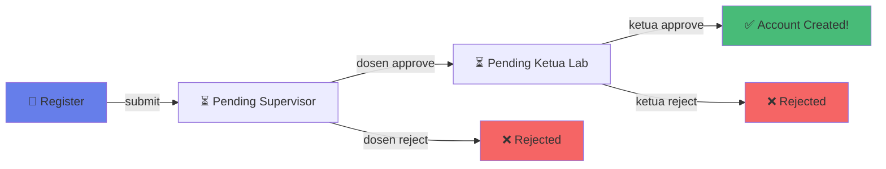
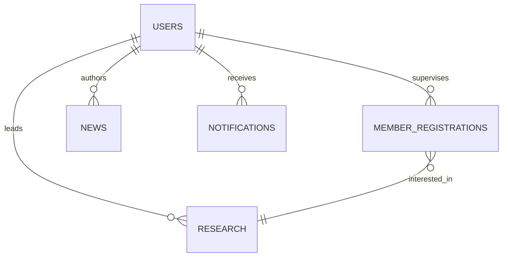

<div align="center">

# 🤖✨ Lab IVSS Portal

### _Intelligent Vision & Smart System Laboratory_

**🏫 Politeknik Negeri Malang** | **💻 Project Based Learning**

[](https://www.php.net/)
[](https://www.postgresql.org/)
[](https://tailwindcss.com/)


---

</div>

## 🎯 Tentang Project

Portal manajemen lab yang **next-level** untuk Lab IVSS (Computer Vision, AI, IoT) - tempat dimana teknologi bertemu dengan kreativitas! 🚀

### ✨ Kenapa Project Ini Keren?

```
🎓 Member Registration   → Sistem approval 2 tingkat yang smooth
📊 Research Tracking     → Monitor riset & publikasi real-time
🔬 Equipment Manager     → Inventaris lab dalam genggaman
📈 Analytics Dashboard   → Data visualization yang aesthetic
```

> 💡 **Fun Fact:** Dibuat dengan **pure PHP OOP** tanpa framework - _back to basics, but make it modern!_

---

## 📑 Quick Navigation

<table>
<tr>
<td width="50%">

### 🎨 **User Interface**
- [🌟 Fitur Unggulan](#-fitur-unggulan)
- [👥 User Roles](#-user-roles--hak-akses)
- [🧪 Testing](#-testing--demo-account)

</td>
<td width="50%">

### ⚙️ **Tech Stuff**
- [💾 Database](#-database-schema)
- [🛠️ Tech Stack](#️-tech-stack)
- [📦 Instalasi](#-instalasi-cepat)

</td>
</tr>
</table>

---

## 🌟 Fitur Unggulan

### 👨‍💼 **Admin & Ketua Lab**
```
✨ Full control panel - manage semua user
✅ Approval akhir pendaftaran member
📰 Kelola berita & update lab
🔔 Real-time notifications (ada badge counter loh!)
```

### 👨‍🏫 **Dosen**
```
📊 Dashboard statistik mahasiswa bimbingan
✅ Approve pendaftar (first approval)
📝 CRUD publikasi (jurnal, konferensi, Scopus Q1/Q2)
👥 List & filter mahasiswa by angkatan
📤 Export data ke Excel
```

### 🧑‍🎓 **Member**
```
🏠 Personal dashboard dengan riset & publikasi
👤 Edit profile & ganti password
📚 Akses database riset lab
📖 Baca berita & update terbaru
```

### 🌐 **Public Access**
```
🎨 Landing page yang aesthetic
📝 Form pendaftaran online
🔍 Browse riset & publikasi
📰 Info kegiatan lab
```

---

## 💾 Database Schema

### 🗂️ **8 Tabel Utama**

<table>
<tr>
<td width="50%">

#### Core Tables
- 👥 **users** - Data pengguna (4 role)
- 📝 **member_registrations** - Approval system
- 🔬 **research** - Project & riset
- 📰 **news** - Berita & update

</td>
<td width="50%">

#### Supporting Tables
- 🔔 **notifications** - Real-time notif
- 📚 **publications** - Karya ilmiah
- 🛠️ **equipment** - Inventaris lab
- ⚙️ **system_settings** - Konfigurasi

</td>
</tr>
</table>

### 🔄 Alur Approval Member



### 📊 Entity Relationship



<details>
<summary>📂 Klik untuk lihat struktur tabel USERS</summary>

```sql
CREATE TABLE users (
    id SERIAL PRIMARY KEY,
    name VARCHAR(255) NOT NULL,
    email VARCHAR(255) UNIQUE NOT NULL,
    password VARCHAR(255) NOT NULL,
    role VARCHAR(50) DEFAULT 'member',           -- admin, ketua_lab, dosen, member
    status VARCHAR(50) DEFAULT 'active',          -- active, inactive
    nim VARCHAR(50),                              -- untuk mahasiswa
    nip VARCHAR(50),                              -- untuk dosen
    phone VARCHAR(20),
    angkatan VARCHAR(10),
    origin VARCHAR(255),
    supervisor_id INTEGER REFERENCES users(id),   -- dosen pembimbing
    created_at TIMESTAMP DEFAULT CURRENT_TIMESTAMP,
    updated_at TIMESTAMP DEFAULT CURRENT_TIMESTAMP,
    last_login TIMESTAMP
);
```
</details>

---

## 🛠️ Tech Stack

<div align="center">

### Backend Power 💪


### Frontend Magic ✨


</div>

| Teknologi | Fungsi | Kenapa Pilih Ini? |
|-----------|---------|-------------------|
| **PHP Native 8.x** | Backend Logic | OOP murni, no framework bloat! 🎯 |
| **PostgreSQL 14+** | Database | Robust & production-ready 💪 |
| **Tailwind CSS** | Styling | Utility-first, super customizable 🎨 |
| **Vanilla JS** | Interactivity | Lightweight & blazing fast ⚡ |

<div align="center">

> 💡 **No Framework?** Yup! Fokus ke fundamental - _master the basics first!_

</div>

---

## 📁 Struktur Project

```
📦 Lab ivss/
├── 🗂️ app/
│   ├── ⚙️ config/
│   │   └── database.php              # PostgreSQL connection
│   ├── 🎮 controllers/                # 6 controllers (~110 KB)
│   │   ├── AdminController.php       # Admin & Ketua Lab (44 KB)
│   │   ├── AuthController.php        # Login/Register (15 KB)
│   │   ├── MemberController.php      # Member dashboard (13 KB)
│   │   └── UserController.php        # User CRUD (14 KB)
│   └── 🛠️ helpers/                    # Helper functions
│
├── 🎨 view/
│   ├── admin/                         # Admin & Dosen panel
│   │   ├── publications/             # Publikasi dosen
│   │   ├── students/                 # Mahasiswa bimbingan
│   │   ├── members/approve.php       # Approval system
│   │   └── dashboard.php
│   ├── member/
│   │   ├── settings/                 # Profile & password
│   │   └── dashboard.php
│   ├── layouts/                      # Reusable layouts
│   └── auth/                         # Login, register
│
├── 🌐 public/
│   ├── index.php                     # Router utama (160 lines)
│   └── assets/                       # CSS, JS, images
│
├── 💾 database/
│   └── setup_database.sql            # DB setup lengkap (722 lines)
│
└── 📖 README.md                       # You are here! 👋
```

<div align="center">

### 📊 Project Stats


</div>

---

## 📦 Instalasi Cepat

### ✅ Prerequisites

```
✔️ PHP >= 8.0
✔️ PostgreSQL >= 14
✔️ Apache/Nginx
```

### 🚀 Quick Start (3 Steps!)

```bash
# 1️⃣ Clone repository
git clone https://github.com/hafisc/lab-ivss-pbl.git
cd lab-ivss-pbl

# 2️⃣ Setup database
psql -U postgres
CREATE DATABASE lab_ivss;
\c lab_ivss
\i database/setup_database.sql
\q

# 3️⃣ Konfigurasi & run!
# Edit app/config/database.php (sesuaikan kredensial)
# Akses: http://localhost/lab-ivss-pbl/public
```

> 🎉 **Done!** Sekarang tinggal login pakai akun demo di bawah!

---

## 👥 User Roles & Hak Akses

### 🏆 Role Hierarchy

```
┌─────────────────┐
│   👑 Admin      │  ← Superuser (full access)
└────────┬────────┘
         │
┌────────▼────────┐
│ 🎯 Ketua Lab    │  ← Final approver
└────────┬────────┘
         │
┌────────▼────────┐
│ 👨‍🏫 Dosen       │  ← First approver
└────────┬────────┘
         │
┌────────▼────────┐
│ 🧑‍🎓 Member      │  ← Student/Researcher
└─────────────────┘
```

### 🔐 Permission Matrix

| Fitur | Admin | Ketua Lab | Dosen | Member |
|-------|:-----:|:---------:|:-----:|:------:|
| 👥 User Management | ✅ | ✅ | ❌ | ❌ |
| ✅ Approve Member (1st) | ❌ | ❌ | ✅ | ❌ |
| ✅ Approve Member (Final) | ❌ | ✅ | ❌ | ❌ |
| 👁️ View Registrations | 👓 | ✅ | 🔍 | ❌ |
| 📝 Manage Publications | ❌ | ❌ | ✅ | ❌ |
| 📊 View Students | ❌ | ❌ | ✅ | ❌ |
| ✏️ Edit Profile | ✅ | ✅ | ✅ | ✅ |
| 🔑 Change Password | ✅ | ✅ | ✅ | ✅ |

> 👓 = read-only | 🔍 = filtered (own students only)

<details>
<summary>📋 Klik untuk detail role-specific features</summary>

#### 👑 **Admin**
- Full system access (god mode)
- CRUD semua user
- View-only approval (monitoring aja, gak bisa approve/reject)
- System settings

#### 🎯 **Ketua Lab**
- Final approval pendaftar (after dosen)
- CRUD riset, berita, equipment
- Real-time notifications
- Overview seluruh lab

#### 👨‍🏫 **Dosen**
- First approval pendaftar (mahasiswa sendiri)
- CRUD publikasi pribadi
- Filter & export data mahasiswa
- Monitor riset bimbingan

#### 🧑‍🎓 **Member**
- Personal dashboard
- Edit profile & change password
- View-only lab resources
- Akses publikasi & riset

</details>

---

## 🛣️ API Routes

### 🌐 Base URL
```
http://localhost/Lab%20ivss/public/index.php?page={route}
```

### 🗺️ Route Map

<table>
<tr>
<th width="30%">Route</th>
<th width="25%">Access</th>
<th width="45%">Purpose</th>
</tr>

<tr>
<td><code>🏠 home</code></td>
<td>🌐 Public</td>
<td>Landing page</td>
</tr>

<tr>
<td><code>🔐 login</code></td>
<td>🌐 Public</td>
<td>Authentication</td>
</tr>

<tr>
<td><code>📝 register</code></td>
<td>🌐 Public</td>
<td>Member registration</td>
</tr>

<tr>
<td><code>👨‍💼 admin</code></td>
<td>🔒 Admin/Ketua/Dosen</td>
<td>Dashboard</td>
</tr>

<tr>
<td><code>✅ admin-registrations</code></td>
<td>🔒 Admin/Ketua/Dosen</td>
<td>Approval member</td>
</tr>

<tr>
<td><code>📚 admin-publications</code></td>
<td>🔒 Dosen</td>
<td>Publikasi dosen</td>
</tr>

<tr>
<td><code>👥 admin-students</code></td>
<td>🔒 Dosen</td>
<td>Mahasiswa bimbingan</td>
</tr>

<tr>
<td><code>🧑‍🎓 member</code></td>
<td>🔒 Member</td>
<td>Member dashboard</td>
</tr>

<tr>
<td><code>⚙️ member-settings</code></td>
<td>🔒 Member</td>
<td>View profile</td>
</tr>

<tr>
<td><code>✏️ member-settings-edit</code></td>
<td>🔒 Member</td>
<td>Edit profile</td>
</tr>

<tr>
<td><code>🔑 member-change-password</code></td>
<td>🔒 Member</td>
<td>Change password</td>
</tr>

</table>

---

## 🧪 Testing & Demo Account

### 🎭 Test Accounts

<table>
<tr>
<th>Role</th>
<th>Email</th>
<th>Password</th>
<th>Access Level</th>
</tr>

<tr>
<td>👑 <strong>Admin</strong></td>
<td><code>admin@ivss.polinema.ac.id</code></td>
<td><code>admin123</code></td>
<td>⭐⭐⭐⭐⭐</td>
</tr>

<tr>
<td>🎯 <strong>Ketua Lab</strong></td>
<td><code>ketualab@ivss.polinema.ac.id</code></td>
<td><code>admin123</code></td>
<td>⭐⭐⭐⭐</td>
</tr>

<tr>
<td>👨‍🏫 <strong>Dosen</strong></td>
<td><code>budi.dosen@polinema.ac.id</code></td>
<td><code>admin123</code></td>
<td>⭐⭐⭐</td>
</tr>

<tr>
<td>🧑‍🎓 <strong>Member</strong></td>
<td><code>ahmad@student.polinema.ac.id</code></td>
<td><code>admin123</code></td>
<td>⭐⭐</td>
</tr>
</table>

> ⚠️ **PENTING:** Ganti password default setelah pertama login!

### 📦 Sample Data

```
👥  7 Users         (1 admin, 1 ketua lab, 3 dosen, 2 member)
📝  6 Registrations (pending approval - buat latihan approve)
🔬  5 Research      (berbagai kategori & status)
📰  5 News          (draft & published)
🛠️  15 Equipment    (lab inventory)
📚  8 Publications  (jurnal & konferensi)
```

### 🎬 Test Scenarios

<details>
<summary>▶️ Scenario 1: Dosen melakukan approval</summary>

```
1. Login sebagai: budi.dosen@polinema.ac.id
2. Buka menu "Registrations"
3. Lihat 2 pendaftar (Budi Santoso, Yusuf Rahman)
4. Klik "Approve" → status berubah jadi "pending_lab_head"
5. Notifikasi ke Ketua Lab ✅
```
</details>

<details>
<summary>▶️ Scenario 2: Ketua Lab final approval</summary>

```
1. Login sebagai: ketualab@ivss.polinema.ac.id
2. Buka menu "Registrations"
3. Lihat pendaftar yang sudah approved dosen (Andi Pratama)
4. Klik "Approve" → CREATE akun user baru! 🎉
5. Member bisa langsung login
```
</details>

<details>
<summary>▶️ Scenario 3: Member edit profile</summary>

```
1. Login sebagai: ahmad@student.polinema.ac.id
2. Klik menu "Settings"
3. Edit: Name, Email, NIM, Phone, Angkatan, Origin
4. Save Changes ✅
5. Bonus: Ganti password (min 6 karakter)
```
</details>

---

## 🔒 Security Features

<div align="center">

### _"Security bukan pilihan, tapi keharusan!"_ 🛡️

</div>

| Feature | Implementation | Status |
|---------|----------------|--------|
| 🔐 Password Hashing | `password_hash()` BCrypt | ✅ |
| 💉 SQL Injection Prevention | Parameterized queries | ✅ |
| 🛡️ XSS Prevention | `htmlspecialchars()` | ✅ |
| 🎫 Session Management | PHP Sessions | ✅ |
| 👮 Role-Based Access Control | Permission matrix | ✅ |
| ✉️ Email Uniqueness | DB UNIQUE constraint | ✅ |
| 🕐 Timezone Sync | Asia/Jakarta | ✅ |

---

## 🚀 Development Roadmap

### ✅ **Udah Kelar** (Current Version)

- [x] 💾 Database design (8 tabel + relasi lengkap)
- [x] 🔐 Authentication & authorization (4 role berbeda)
- [x] ✅ Approval system 2 tingkat (dosen → ketua lab)
- [x] 📚 Publikasi dosen & mahasiswa bimbingan
- [x] ⚙️ Member settings (edit profile, ganti password)
- [x] 🔔 Real-time notifications (ada badge counter!)
- [x] 📱 Responsive UI (mobile-friendly pakai Tailwind)

### 🚧 **Next Up** (Coming Soon™)

- [ ] 📎 File upload (PDF research, publikasi)
- [ ] 📊 Export Excel (publikasi, data mahasiswa)
- [ ] 📧 Email notifications (SMTP integration)
- [ ] 🔍 Advanced search & filtering
- [ ] 📝 Activity logs & audit trail
- [ ] 📱 REST API (untuk mobile app)
- [ ] 🌙 Dark mode toggle
- [ ] 📈 Advanced analytics dashboard


---

## 📄 License

```
MIT License (Campus Project)

Copyright (c) 2024 Hafis - Lab IVSS Polinema

Permission is hereby granted, free of charge, to any person obtaining a copy
of this software for educational purposes.
```

> 🎓 **Educational Purpose Only** - Proyek tugas kampus (PBL)

---


