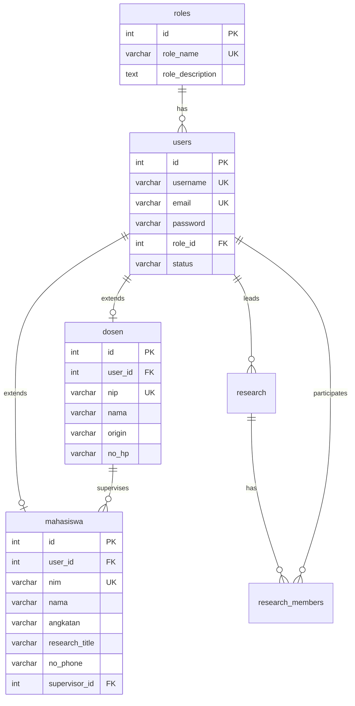

# Dokumentasi Perubahan Database Lab IVSS

## Ringkasan Perubahan

Database Lab IVSS telah di-**restructure** untuk meningkatkan normalisasi dan menghilangkan redundansi. Perubahan utama adalah pemisahan tabel `users` menjadi beberapa tabel spesifik berdasarkan role.

---

## Struktur Database Baru

### 📊 Diagram Relasi Tabel Utama



---

## Perubahan Detail

### ✅ Tabel Baru

#### 1. **`roles`** (Master Data)
Tabel untuk menyimpan role yang tersedia dalam sistem.

**Kolom:**
- `id` - SERIAL PRIMARY KEY
- `role_name` - VARCHAR(50) UNIQUE (admin, ketua_lab, dosen, mahasiswa)
- `role_description` - TEXT
- `created_at` - TIMESTAMP

#### 2. **`dosen`** 
Data spesifik untuk dosen/pengampu.

**Kolom:**
- `id` - SERIAL PRIMARY KEY
- `user_id` - INTEGER UNIQUE FK → users(id)
- `nip` - VARCHAR(50) UNIQUE
- `nama` - VARCHAR(255)
- `origin` - VARCHAR(255) (asal institusi/pendidikan)
- `no_hp` - VARCHAR(20)

#### 3. **`mahasiswa`**
Data spesifik untuk mahasiswa/member lab.

**Kolom:**
- `id` - SERIAL PRIMARY KEY
- `user_id` - INTEGER UNIQUE FK → users(id)
- `nim` - VARCHAR(50) UNIQUE
- `nama` - VARCHAR(255)
- `angkatan` - VARCHAR(10)
- `research_title` - VARCHAR(255)
- `no_phone` - VARCHAR(20)
- `supervisor_id` - INTEGER FK → dosen(id)

---

### 🔄 Tabel yang Diubah

#### **`users`** (Restructured)

**Kolom yang DITAMBAHKAN:**
- ✅ `username` - VARCHAR(100) UNIQUE
- ✅ `role_id` - INTEGER FK → roles(id)

**Kolom yang DIHAPUS:**
- ❌ `name` → Pindah ke tabel `dosen` / `mahasiswa`
- ❌ `role` → Diganti dengan `role_id` (FK)
- ❌ `nim` → Pindah ke tabel `mahasiswa`
- ❌ `nip` → Pindah ke tabel `dosen`
- ❌ `phone` → Pindah ke tabel spesifik (`no_hp` / `no_phone`)
- ❌ `angkatan` → Pindah ke tabel `mahasiswa`
- ❌ `origin` → Pindah ke tabel `dosen`
- ❌ `research_title` → Pindah ke tabel `mahasiswa`
- ❌ `supervisor_id` → Pindah ke tabel `mahasiswa` (mengacu ke `dosen.id`)
- ❌ `motivation` → Hanya untuk registration, tidak perlu di users

**Kolom yang TETAP:**
- `id`, `email`, `password`, `status`, `photo`, `bio`, `created_at`, `updated_at`, `last_login`

#### **`research`** (Optimized)

**Kolom yang DIHAPUS:**
- ❌ `team_members` (TEXT) → Gunakan tabel `research_members`
- ❌ `publications` (TEXT) → Gunakan relasi ke tabel publikasi

**Alasan:** Kolom TEXT untuk menyimpan list tidak normalized dan sulit untuk query.

---

## Relasi Foreign Key Penting

| Tabel Source | Kolom | References | Keterangan |
|-------------|-------|-----------|-----------|
| `users` | `role_id` | `roles(id)` | Role user |
| `dosen` | `user_id` | `users(id)` | 1-to-1 dengan user |
| `mahasiswa` | `user_id` | `users(id)` | 1-to-1 dengan user |
| `mahasiswa` | `supervisor_id` | `dosen(id)` | Dosen pembimbing |
| `research` | `leader_id` | `users(id)` | Leader riset |
| `research_members` | `user_id` | `users(id)` | Member riset |
| `research_members` | `research_id` | `research(id)` | Riset yang diikuti |

---

## Data Sample

### Users & Roles

| ID | Username | Email | Role | Status |
|----|----------|-------|------|--------|
| 1 | admin_ivss | admin@ivss.polinema.ac.id | admin | active |
| 2 | dr_hasan | ketualab@ivss.polinema.ac.id | ketua_lab | active |
| 3 | budi_dosen | budi.dosen@polinema.ac.id | dosen | active |
| 4 | andi_dosen | andi.dosen@polinema.ac.id | dosen | active |
| 5 | siti_dosen | siti.dosen@polinema.ac.id | dosen | active |
| 6 | ahmad_fauzi | ahmad@student.polinema.ac.id | mahasiswa | active |
| 7 | agus_prasetyo | agus@alumni.polinema.ac.id | mahasiswa | inactive |

### Dosen

| ID | User ID | NIP | Nama | Origin |
|----|---------|-----|------|--------|
| 1 | 3 | 197505152000031001 | Dr. Budi Santoso | S3 TI - ITB |
| 2 | 4 | 198003102005011002 | Dr. Andi Wijaya | S3 CS - UGM |
| 3 | 5 | 198206182008012003 | Dr. Siti Nurhaliza | S3 AI - ITS |

### Mahasiswa

| ID | User ID | NIM | Nama | Angkatan | Supervisor |
|----|---------|-----|------|----------|------------|
| 1 | 6 | 2141720010 | Ahmad Fauzi | 2024 | Dr. Budi (id=1) |
| 2 | 7 | 2131720001 | Agus Prasetyo | 2021 | Dr. Andi (id=2) |

---

## Keuntungan Struktur Baru

### 🎯 Normalisasi Lebih Baik
- Data tidak redundan
- Setiap tabel punya tanggung jawab yang jelas
- Mudah untuk extend (tambah tabel baru untuk role baru)

### 🔒 Data Integrity
- Foreign key constraints memastikan konsistensi data
- Cascade delete otomatis membersihkan data terkait

### 🚀 Query Lebih Fleksibel
```sql
-- Get semua dosen dengan jumlah mahasiswa bimbingan
SELECT d.nama, COUNT(m.id) as jumlah_mahasiswa
FROM dosen d
LEFT JOIN mahasiswa m ON m.supervisor_id = d.id
GROUP BY d.id, d.nama;

-- Get mahasiswa dengan info user dan supervisor
SELECT m.nama, m.nim, u.email, d.nama as nama_supervisor
FROM mahasiswa m
JOIN users u ON m.user_id = u.id
LEFT JOIN dosen d ON m.supervisor_id = d.id;
```

### 📊 Scalability
- Mudah menambah role baru (tinggal insert di `roles` dan buat tabel spesifik)
- Tidak perlu ALTER TABLE `users` setiap ada role baru

---

## Migration Guide

Jika ada aplikasi yang menggunakan struktur lama, berikut panduan migrasi:

### Query Lama → Query Baru

**Lama:**
```sql
SELECT * FROM users WHERE role = 'dosen';
```

**Baru:**
```sql
SELECT u.*, d.* 
FROM users u
JOIN dosen d ON u.id = d.user_id
WHERE u.role_id = 3;  -- 3 = role dosen
```

**Lama:**
```sql
SELECT * FROM users WHERE role = 'member' AND status = 'active';
```

**Baru:**
```sql
SELECT u.*, m.* 
FROM users u
JOIN mahasiswa m ON u.id = m.user_id
WHERE u.role_id = 4 AND u.status = 'active';  -- 4 = role mahasiswa
```

---

## Total Tabel: 14

1. `roles` ✨ BARU
2. `users` 🔄 RESTRUCTURED
3. `dosen` ✨ BARU
4. `mahasiswa` ✨ BARU
5. `research` 🔄 OPTIMIZED
6. `member_registrations`
7. `news`
8. `equipment`
9. `system_settings`
10. `publications`
11. `notifications`
12. `research_members`
13. `research_documents`
14. `member_publications`

---

## Catatan Penting

> [!WARNING]
> Password default untuk SEMUA user adalah: **admin123**
> 
> Jangan lupa untuk mengubah password setelah login pertama kali!

> [!TIP]
> Gunakan query dengan JOIN untuk mendapatkan data lengkap dari users + dosen/mahasiswa
> 
> Contoh:
> ```sql
> -- View lengkap untuk dosen
> CREATE VIEW view_dosen AS
> SELECT u.*, d.nip, d.nama, d.origin, d.no_hp
> FROM users u
> JOIN dosen d ON u.id = d.user_id;
> ```
